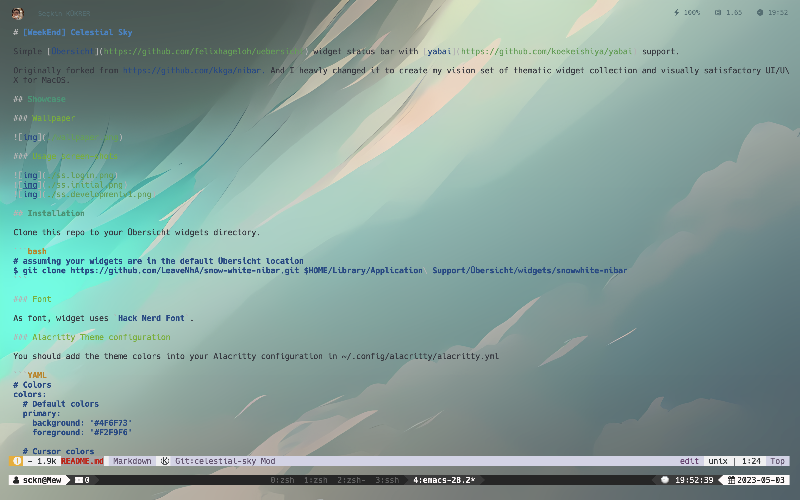

# [WeekEnd] Celestial Sky

Simple [Übersicht](https://github.com/felixhageloh/uebersicht) widget status bar with [yabai](https://github.com/koekeishiya/yabai) support.

Originally forked from https://github.com/kkga/nibar. And I heavly changed it to create my vision set of thematic widget collection and visually satisfactory UI/UX for MacOS.

## Showcase

### Wallpaper


### Usage screen-shots




## Installation

Clone this repo to your Übersicht widgets directory.

```bash
# assuming your widgets are in the default Übersicht location
$ git clone https://github.com/LeaveNhA/weekend-celestial-sky.git $HOME/Library/Application\ Support/Übersicht/widgets/celestial-blue-nibar
```

### Font

As font, widget uses `Hack Nerd Font`.

### Alacritty Theme configuration

You should add the theme colors into your Alacritty configuration in ~/.config/alacritty/alacritty.yml

```YAML
# Colors
colors:
  # Default colors
  primary:
    background: '#4F6F73'
    foreground: '#F2F9F6'

  # Cursor colors
  cursor:
    cursor: '#1A4749'
    text: '#F2F9F6'

  # Normal colors
  normal:
    black: '#1A4749'
    blue: '#50A2A7'
    cyan: '#1EC1C0'
    green: '#A9D9C7'
    magenta: '#7BA69E'
    red: '#04D9B2'
    white: '#F2F9F6'
    yellow: '#05F2C7'

  # Bright colors
  bright:
    black: '#2C5D60'
    blue: '#79C6C9'
    cyan: '#3DE0DE'
    green: '#CCEAE5'
    magenta: '#9DBEB7'
    red: '#29E8C4'
    white: '#FFFFFF'
    yellow: '#17F7E5'

  # Selection colors
  selection:
    background: '#3A888B'
    text: '#F2F9F6'
```

## Dependencies

- [SF Symbols](https://developer.apple.com/sf-symbols/) (dictated) — used for symbols in the statusbar widget

## Usage

### Refreshing yabai workspaces widget

This library doesn't require any Yabai sided refreshing, yet. Until then, stay focused!
