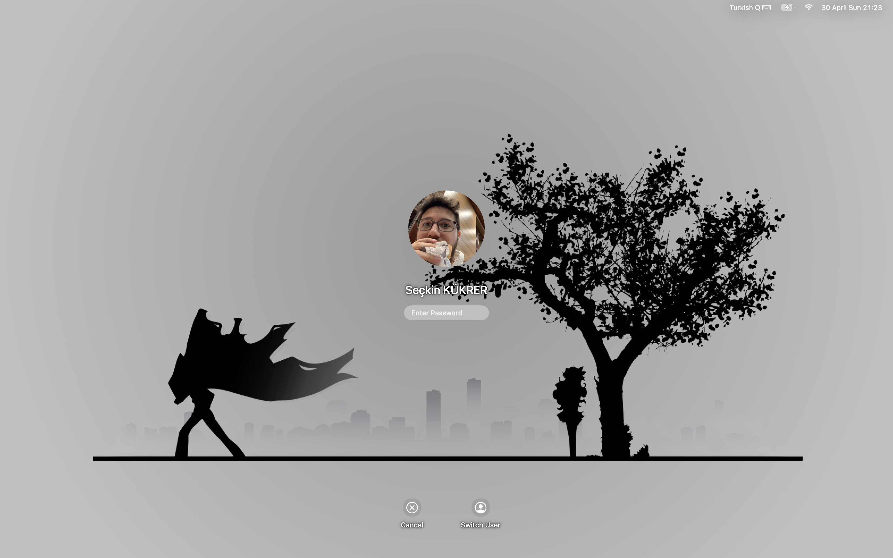
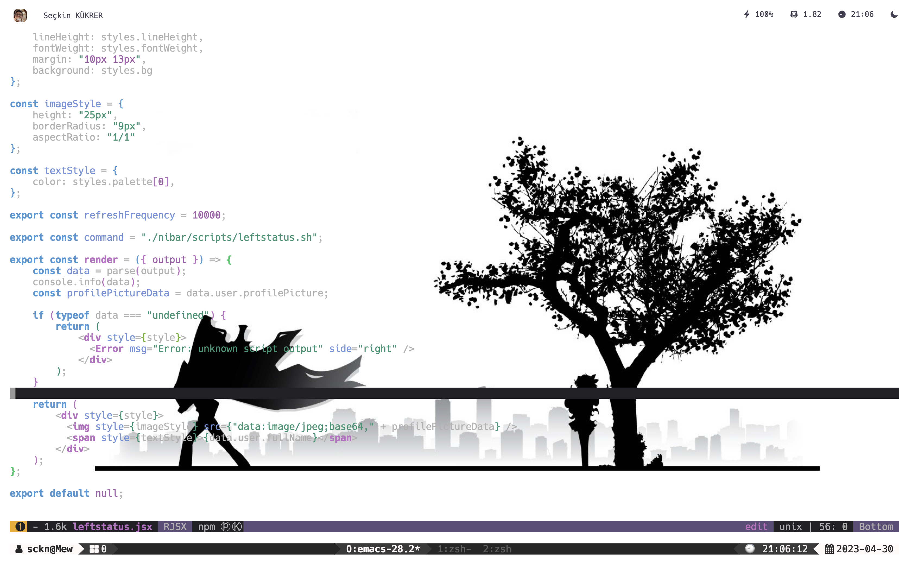
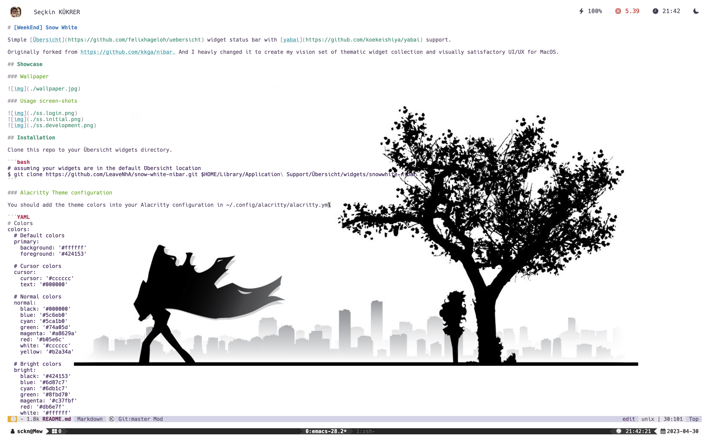

# [WeekEnd] Snow White

Simple [Übersicht](https://github.com/felixhageloh/uebersicht) widget status bar with [yabai](https://github.com/koekeishiya/yabai) support.

Originally forked from https://github.com/kkga/nibar. And I heavly changed it to create my vision set of thematic widget collection and visually satisfactory UI/UX for MacOS.

## Showcase

### Wallpaper


### Usage screen-shots





## Installation

Clone this repo to your Übersicht widgets directory.

```bash
# assuming your widgets are in the default Übersicht location
$ git clone https://github.com/LeaveNhA/snow-white-nibar.git $HOME/Library/Application\ Support/Übersicht/widgets/snowwhite-nibar
```

### Alacritty Theme configuration

You should add the theme colors into your Alacritty configuration in ~/.config/alacritty/alacritty.yml

```YAML
# Colors
colors:
  # Default colors
  primary:
    background: '#ffffff'
    foreground: '#424153'

  # Cursor colors
  cursor:
    cursor: '#cccccc'
    text: '#000000'

  # Normal colors
  normal:
    black: '#000000'
    blue: '#5c6eb0'
    cyan: '#5ca1b0'
    green: '#74a05d'
    magenta: '#a8629a'
    red: '#b05e6c'
    white: '#cccccc'
    yellow: '#b2a34a'

  # Bright colors
  bright:
    black: '#424153'
    blue: '#6d87c7'
    cyan: '#6db1c7'
    green: '#8fbd70'
    magenta: '#c37fbf'
    red: '#db6e7f'
    white: '#ffffff'
    yellow: '#d4c158'

  # Selection colors
  selection:
    background: '#f0f0f0'
    text: '#424153'
```

## Dependencies

- [SF Symbols](https://developer.apple.com/sf-symbols/) (dictated) — used for symbols in the statusbar widget

## Usage

### Refreshing yabai workspaces widget

This library doesn't require any Yabai sided refreshing, yet. Until then, stay focused!
